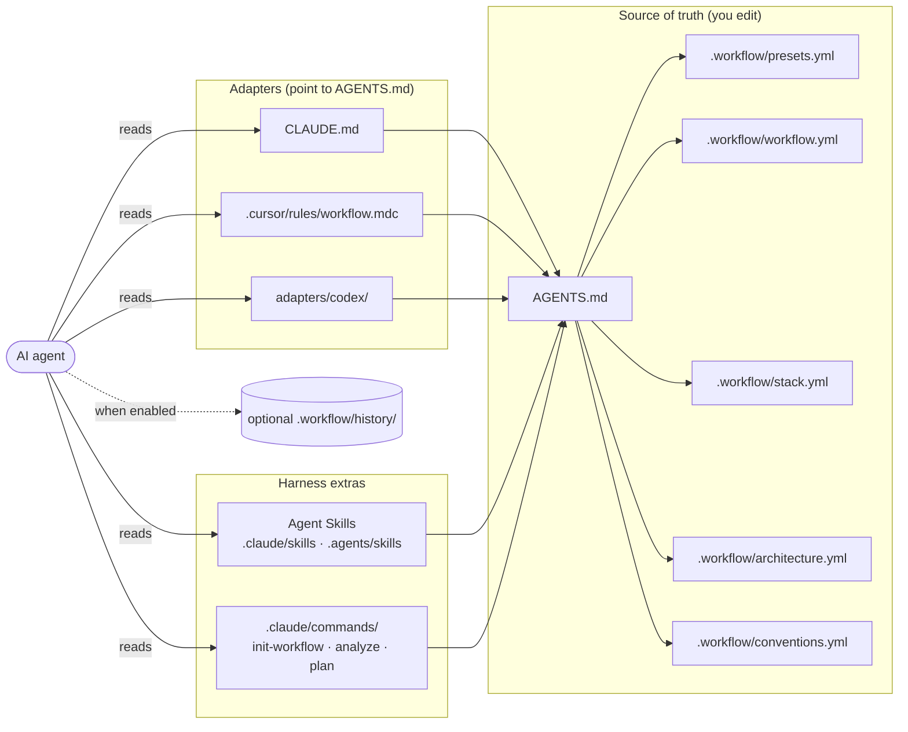

# Hekate

[](https://github.com/MugenKaizen/Hekate/releases)
[](LICENSE)

> **Status: early-stage, work in progress.** The workflow is still evolving
> and undergoing early testing. Expect rough edges, breaking changes, and
> missing pieces. Feedback and issue reports are very welcome.

A workflow for AI assistants that tries not to be tied to any specific
agent. Aims to fit typical development projects. One installation — the
same rules for Claude Code, Cursor, Codex/Copilot, Aider, Gemini CLI,
and any other agent that reads `AGENTS.md`.

## What's in the box

- **A single source of truth** (`AGENTS.md` + `.workflow/*.yml`)
  regardless of which agent the developer uses. Startup stays cheap through
  `.workflow/status.yml`, a small pre-flight index; detailed YAML is loaded
  only when a task needs it.
- **An adaptive workflow** that uses only the process the task needs:
  Understand, Decide when a material choice exists, Plan when risk or size
  warrants it, Execute, and Verify.

  ```mermaid
  flowchart LR
      U[Understand] --> D{Material choice?}
      D -- yes --> C[Decide]
      D -- no --> P{Plan needed?}
      C --> P
      P -- yes --> WP[Plan]
      P -- no --> E[Execute]
      WP --> E
      E --> V{Verify}
      V -- pass --> DONE([Done])
      V -- fail --> U
  ```

- **Workflow profiles** picked at initialization: `fast`, `medium`, `full`, or
  `custom`. Profiles tune test evidence, optional history, and scope controls;
  they never authorize commits or branch creation.
- **Explicit TDD modes**: `off`, `prefer-test-first`, and
  `require-test-evidence`.
- **Advisory preflight refusal** asks portable agents not to edit before the
  project is described. Supporting runtime integrations can enforce this
  mechanically.
- **Optional local history** for resumable work, disabled by default and free
  of mandatory per-stage artifacts.
- **Harness-owned native subagents**: permission and consent stay with the
  active harness; external delegation is never an automatic fallback.
- **Legacy orchestration compatibility** for existing `0.x` installations.
  It is experimental and no longer part of the fresh default payload.

## Goals

These are the problems the workflow tries to address. Whether it
actually helps in practice is something only real use will show.

- **One set of rules across agents.** AI tools rely on different
  instruction formats, so team rules tend to get duplicated and drift
  apart. The workflow treats `AGENTS.md` and `.workflow/*.yml` as the
  source of truth, with `.workflow/status.yml` as the fast entry point, so
  Claude, Cursor, Codex, and others can read the same rules.
- **Re-entry into sessions without rebuilding context from scratch.**
  Context is normally scattered across source code, old chats, and
  partial docs. The workflow tries to give the agent a structured view
  of the stack, architecture, conventions, and process up front.
- **Avoiding blind edits.** An agent should not start changing code before it
  has enough project context. Portable files advise refusal; runtime gates can
  enforce it mechanically.
- **Matching structure to risk.** Obvious fixes should not require artificial
  alternatives or approval turns, while risky and resumable work should carry
  an explicit plan and verification method.
- **Keeping continuity when useful.** Optional compact notes preserve progress
  for resumable work without forcing history artifacts on every task.
- **Matching process depth to the task.** Different tasks need different
  levels of rigor. Presets (`fast`, `medium`, `full`, `custom`) exist so
  the workflow doesn't have to be one rigid mode.
- **Staying portable.** Many AI setups are tightly coupled to a single
  vendor or editor. A foundation of plain Markdown and YAML is meant to
  keep things easy to carry across tools and projects.

## Documentation

- [Cross-harness orchestration](docs/orchestration.md)
- [Customization](docs/customization.md)
- [Design philosophy](docs/philosophy.md)
- [Deterministic core and CLI](docs/core.md)
- [Local testing guide](TESTING.md)
- [Roadmap: pi integration](docs/roadmap.md)
- [Changelog](CHANGELOG.md)
- [Release process](RELEASING.md)

Release notes live in [`docs/releases/`](docs/releases). The latest is
[`v0.3.0-beta.1`](docs/releases/v0.3.0-beta.1.md), which introduces the typed
configuration contract, transactional portable upgrades, and the Pi wrapper.

## Installation

Choose a trusted full 40-character commit SHA from a published release. Use the
same SHA for both the bootstrap script and the source snapshot:

```sh
HEKATE_COMMIT='<full-40-character-commit-sha>'
curl -fsSL "https://raw.githubusercontent.com/MugenKaizen/Hekate/$HEKATE_COMMIT/install.sh" \
  | sh -s -- --commit="$HEKATE_COMMIT"
```

On Windows PowerShell 5.1+:

```powershell
[Net.ServicePointManager]::SecurityProtocol = [Net.SecurityProtocolType]::Tls12
$HekateCommit = '<full-40-character-commit-sha>'
$Script = Invoke-RestMethod "https://raw.githubusercontent.com/MugenKaizen/Hekate/$HekateCommit/install.ps1"
& ([scriptblock]::Create($Script)) -Commit $HekateCommit
```

Or with flags:

```sh
curl -fsSL "https://raw.githubusercontent.com/MugenKaizen/Hekate/$HEKATE_COMMIT/install.sh" \
  | sh -s -- --commit="$HEKATE_COMMIT" --target=. --agents=claude,cursor,codex
```

Windows PowerShell 5.1+:

```powershell
& ([scriptblock]::Create($Script)) -Commit $HekateCommit -Target . -Agents claude,cursor,codex
```

Supported flags:

| Flag | Purpose |
|------|---------|
| `--target=<path>` | Where to install. Defaults to the current directory. |
| `--agents=<list>` | Which adapters to lay down: `claude`, `cursor`, `codex`, `copilot`, `gemini`, `aider`, `pi`. Defaults to all. |
| `--force` | Transactionally reconcile an existing Hekate installation. |
| `--yes` | Skip the `--force` confirmation prompt. Required when piping into `sh`. |
| `--dry-run` | Show what would be done without making changes. |
| `--commit=<sha>` | Full 40-character commit SHA. Required for network downloads. |
| `--ref=<git-ref>` | Revision metadata for local `--source` development only. |
| `--source=<path>` | Local copy of the repository (for debugging). |

PowerShell accepts the same options as named parameters: `-Target`, `-Agents`,
`-Force`, `-Yes`, `-DryRun`, `-Commit`, `-Ref`, `-Source`, and `-Repo`. If Hekate is
already installed, the installer refuses to rewrite migration state; use the update
command instead (or explicit `--force` / `-Force` for a transactional upgrade).

On an existing installation, `--force` runs the version-aware transaction engine.
It validates and summarizes ownership-aware operations before confirmation, stages
offline rollback data, applies atomically, and verifies the resulting installation.
A piped invocation has no terminal to prompt on and therefore aborts without writing
unless you also pass `--yes` / `-Yes`. Transactional upgrade requires Node 20+
but not npm: the commit-pinned snapshot contains a reproducible standalone
runtime and copies it into the exact transaction bundle for offline recovery.
Fresh static installation still requires neither Node nor npm.

The commit SHA makes the downloaded content immutable; it does not prove who
authored the commit. Obtain the expected SHA through a trusted channel. Branches,
tags, and short SHAs are deliberately rejected for network downloads.

What will appear in the project:

```
AGENTS.md                          # single source of truth (compact always-read core)
CLAUDE.md                          # → AGENTS.md (Claude Code adapter)
GEMINI.md                          # → AGENTS.md (Gemini CLI adapter)
.aider.conf.yml                    # → AGENTS.md (Aider adapter)
.github/copilot-instructions.md    # → AGENTS.md (Copilot adapter)
.cursor/rules/workflow.mdc         # Cursor adapter
.pi/prompts/                       # Pi prompt templates; settings remain user-owned
.claude/commands/                  # /init-workflow, /analyze, /plan
.claude/skills/                    # Agent Skills for Claude Code
.agents/skills/                    # shared Agent Skills for the non-Claude adapters
.workflow/history-format.md        # optional resumable-note format
.workflow/stack.yml                # fill in at initialization
.workflow/architecture.yml
.workflow/conventions.yml
.workflow/workflow.yml
.workflow/presets.yml              # adaptive profile registry
.workflow/status.yml               # legacy fast pre-flight index
.workflow/bootstrap.md             # initialization procedure
.workflow/state.yml                # installed snapshot + applied migrations
.workflow/README.md
.workflow/history/                 # gitignored
.workflow/backups/                 # gitignored safety backups for updates
.gitignore                         # preserves legacy local ignores too
```

## Hekate Pi wrapper

The Node CLI can run Pi through its public SDK while loading the Hekate gate as
a mandatory inline extension:

```sh
hekate agent
hekate agent --mode=print --prompt="review this change"
hekate agent --mode=json --prompt="run the configured checks" --no-session
hekate agent --mode=rpc
printf 'review this change' | hekate agent --mode=print
```

Add `--subagents` only when bounded wrapper-native child processes are wanted.
Project-local Pi resources require an interactive trust decision in TUI mode
and are untrusted by default in non-interactive modes. Use `--trust-project` or
`--no-trust-project` for an explicit session decision. `--no-context-files`
does not disable the mandatory Hekate gate.
Direct `pi` invocation bypasses wrapper-only enforcement unless the global
`@hekate/pi-extension` package is enabled. See [`docs/pi.md`](docs/pi.md).

## Updating an existing installation

Transactional forced upgrades can be inspected and rolled back offline with
the transaction ID printed by `hekate upgrade`:

```sh
hekate rollback --transaction=<id> --dry-run --json
hekate rollback --transaction=<id> --yes
```

After accepting an upgrade or completing rollback, remove its retained offline
recovery bundle only by exact transaction ID:

```sh
hekate cleanup --transaction=<id> --dry-run --json
hekate cleanup --transaction=<id> --yes
```

Cleanup is never automatic. Recovery states and bundles without terminal or
durable unpublished provenance are preserved.

Choose the trusted full commit SHA to update to. The bootstrap URL and
`--commit` / `-Commit` value must match:

```sh
HEKATE_COMMIT='<full-40-character-commit-sha>'
curl -fsSL "https://raw.githubusercontent.com/MugenKaizen/Hekate/$HEKATE_COMMIT/update.sh" \
  | sh -s -- --target=. --commit="$HEKATE_COMMIT"
```

On Windows PowerShell 5.1+:

```powershell
[Net.ServicePointManager]::SecurityProtocol = [Net.SecurityProtocolType]::Tls12
$HekateCommit = '<full-40-character-commit-sha>'
$Script = Invoke-RestMethod "https://raw.githubusercontent.com/MugenKaizen/Hekate/$HekateCommit/update.ps1"
& ([scriptblock]::Create($Script)) -Target . -Commit $HekateCommit
```

Overwrite locally edited managed files after confirmation:

```sh
curl -fsSL "https://raw.githubusercontent.com/MugenKaizen/Hekate/$HEKATE_COMMIT/update.sh" \
  | sh -s -- --target=. --commit="$HEKATE_COMMIT" --force
```

Windows PowerShell 5.1+:

```powershell
& ([scriptblock]::Create($Script)) -Target . -Commit $HekateCommit -Force
```

Update behavior:

- `update.sh` and `update.ps1` download only the full commit requested via
  `--commit`. With `--force`, both delegate to the same versioned transactional
  Node engine. Without `--force`, they retain the frozen legacy runner for
  compatibility and legacy rollback. `--ref` is accepted only with local
  `--source` development.
- The runner applies pending scripts from `migrations/` in order, based on
  `.workflow/state.yml -> schema.applied_migrations`.
- Upgrades relocate legacy portable skills from `.claude/skills/` to
  `.agents/skills/` for Cursor/Codex projects. Claude projects retain their
  `.claude/skills/` copy, and relocated files are backed up before removal.
- `.workflow/*.yml` is updated conservatively: only known workflow keys are
  changed by explicit migrations. Existing values win, and unknown/custom
  keys are preserved.
- Template-managed files (`AGENTS.md`, Claude/Cursor adapters,
  `.workflow/bootstrap.md`, `.workflow/README.md`) are overwritten only if
  they still match the previously installed template.
- The root `README.md` is updated only when it is the Hekate README and still
  matches the previously installed version; user project READMEs are left alone.
- On the frozen non-force compatibility path, a locally edited template-managed
  file is left in place and a `<file>.new` review copy is written. `--force`
  instead uses the ownership-aware transaction engine described above.
- Before changing any existing file, the legacy updater copies it into a per-run
  directory `.workflow/backups/<UTC-timestamp>/`, preserving relative paths. The
  five most recent runs are kept and older ones pruned. Each run is recorded in
  `.workflow/state.yml → schema.history` with its timestamp, refs, backup
  directory, and the migrations it applied.
- `update-runner.sh --rollback` (or `--rollback=<timestamp>`; `-Rollback` /
  `-RollbackName` in PowerShell) restores a recorded run, including the
  `state.yml` that rewinds `applied_migrations`. It refuses to act when no
  backup exists or the run name is malformed.
- `--agents=<list>` / `-Agents` on an update opts an existing installation into
  an adapter it does not yet have, without a reinstall.
- Older installations without `.workflow/state.yml` are handled in a safe
  legacy mode: YAML migrations still run, but edited template files are not
  overwritten automatically.

## First run in a project

1. After installation, open the project in your agent.
2. Say: **"initialize the workflow"** (or `/init-workflow` in Claude Code).
3. Choose `fast`, `medium`, `full`, or `custom`. The profile controls TDD
   evidence, optional history, and scope guardrails only.
4. The agent then decides the project mode on its own:
   - **New project** → will ask questions about the stack, architecture,
     and conventions.
   - **Existing project** → will read manifests/configs/structure and propose
     YAML drafts, asking for confirmation.
5. Once required fields are validated, the agent refreshes the legacy
   `.workflow/status.yml` preflight index.

## Legacy cross-harness controller

The project-local `hekate-agent` controller remains available to existing
`0.x` installations but is no longer installed by default. It is an
experimental compatibility component, not portable authorization and never an
automatic fallback for unavailable native subagents. See
[`docs/orchestration.md`](docs/orchestration.md). Future orchestration targets
the Hekate wrapper over Pi.

## Development checks

Using npm and `package-lock.json`:

```sh
npm ci
npm test
```

Using Bun 1.3.14+ and `bun.lock`:

```sh
bun install --frozen-lockfile
bun run test:bun
```

Platform and wrapper checks are shared by both dependency paths:

```sh
sh -n install.sh update.sh update-runner.sh migrations/*.sh \
  templates/.workflow/bin/hekate-agent tests/run.sh
./tests/run.sh
```

Tests use fake harness executables and never contact paid model APIs.

`./tests/run.sh` runs the POSIX suite, then runs the PowerShell suite
(`tests/run.ps1`) when `pwsh` or `powershell` is on `PATH` and prints a
`SKIPPED` notice when it is not. The PowerShell half of the codebase is
therefore unverified on machines without a PowerShell interpreter.

## Philosophy

See [`docs/philosophy.md`](docs/philosophy.md) — why this is needed and the
principles behind it. For extending it to your stack, see
[`docs/customization.md`](docs/customization.md).

## Repository structure

```
install.sh              # curl installer
update.sh               # stable bootstrap that downloads a snapshot and runs the updater
update-runner.sh        # versioned update runner from the downloaded snapshot
lib/
  update-common.sh      # shared helpers for runner and migrations
migrations/             # ordered schema migrations for .workflow/*.yml
tests/                  # fake-harness integration and installer/update smoke tests
CHANGELOG.md             # version history
RELEASING.md             # release checklist
templates/              # what gets deployed into the project
  AGENTS.md
  .workflow/            # YAML configs + status index
  skills/               # portable Agent Skills
  adapters/
    claude/             # CLAUDE.md, commands/, agents/
    cursor/             # .cursor/rules/
    codex/              # reference (Codex reads AGENTS.md directly)
    copilot/            # .github/copilot-instructions.md
    gemini/             # GEMINI.md
    aider/              # .aider.conf.yml
  gitignore.snippet
docs/
```

How the pieces read each other once deployed into a project:



## License

MIT — see [`LICENSE`](LICENSE).
