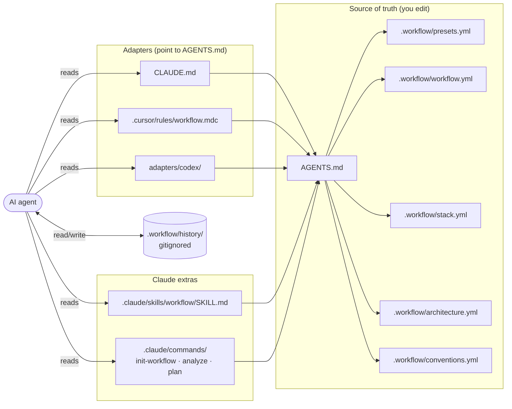

# Hekate

> **Status: early-stage, work in progress.** The workflow is still evolving
> and undergoing early testing. Expect rough edges, breaking changes, and
> missing pieces. Feedback and issue reports are very welcome.

A workflow for AI assistants that tries not to be tied to any specific
agent. Aims to fit typical development projects. One installation — the
same rules for Claude Code, Cursor, Codex/Copilot, Aider, Gemini CLI,
and any other agent that reads `AGENTS.md`.

## What's in the box

- **A single source of truth** (`AGENTS.md` + `.workflow/*.yml`)
  regardless of which agent the developer uses. Startup stays cheap through
  `.workflow/status.yml`, a small pre-flight index; detailed YAML is loaded
  only when a task needs it.
- **A mandatory cycle** for every non-trivial task:
  `Analyze → Options (≥2 with pros/cons) → Plan (self-contained) → Execute → Verify`.

  ```mermaid
  flowchart LR
      A[Analyze] --> O[Options ≥2<br/>with pros/cons]
      O --> P[Plan<br/>self-contained]
      P --> E[Execute]
      E --> V{Verify}
      V -- pass --> D([Done])
      V -- fail --> A
  ```

- **Workflow presets** picked at initialization — `fast` (plan only),
  `medium` (balanced, recommended), `full` (everything including TDD), or
  `custom` (toggle every feature individually). The preset registry is
  declared in `.workflow/presets.yml` and is easy to extend with new
  features without editing `AGENTS.md` or adapter files.
- **Light TDD by default** in the `full` preset for non-trivial behavior
  changes: use a focused test-first loop unless disabled.
- **Granular commits by default** in `medium` and `full` presets for large
  tasks: commit automatically after each verified checkpoint (or ask first).
- **Work is blocked** if the project has not yet been described in the
  configs — no "blind" edits.
- **Local task history** in `.workflow/history/` (in `.gitignore`), so
  the agent remembers context across sessions, including checkpoint checklists
  for large tasks.

## Goals

These are the problems the workflow tries to address. Whether it
actually helps in practice is something only real use will show.

- **One set of rules across agents.** AI tools rely on different
  instruction formats, so team rules tend to get duplicated and drift
  apart. The workflow treats `AGENTS.md` and `.workflow/*.yml` as the
  source of truth, with `.workflow/status.yml` as the fast entry point, so
  Claude, Cursor, Codex, and others can read the same rules.
- **Re-entry into sessions without rebuilding context from scratch.**
  Context is normally scattered across source code, old chats, and
  partial docs. The workflow tries to give the agent a structured view
  of the stack, architecture, conventions, and process up front.
- **Avoiding blind edits.** An agent shouldn't start changing code
  before it has enough project context. Blocking rules hold the
  workflow until the required fields are filled in.
- **Adding a small amount of structure to non-trivial tasks.** It's easy
  to jump straight into implementation and only reason afterward. The
  `Analyze → Options → Plan → Execute → Verify` cycle is an attempt to
  make that less tempting.
- **Keeping continuity between sessions.** When work resumes later,
  intermediate decisions tend to get lost. Compact task history is an
  attempt to preserve what was done, why, and what's left.
- **Matching process depth to the task.** Different tasks need different
  levels of rigor. Presets (`fast`, `medium`, `full`, `custom`) exist so
  the workflow doesn't have to be one rigid mode.
- **Staying portable.** Many AI setups are tightly coupled to a single
  vendor or editor. A foundation of plain Markdown and YAML is meant to
  keep things easy to carry across tools and projects.

## Installation

In the root of the target project:

```sh
curl -fsSL https://raw.githubusercontent.com/MugenKaizen/Hekate/main/install.sh | sh
```

On Windows PowerShell 5.1+:

```powershell
[Net.ServicePointManager]::SecurityProtocol = [Net.SecurityProtocolType]::Tls12; & ([scriptblock]::Create((Invoke-RestMethod https://raw.githubusercontent.com/MugenKaizen/Hekate/main/install.ps1)))
```

Or with flags:

```sh
curl -fsSL https://raw.githubusercontent.com/MugenKaizen/Hekate/main/install.sh \
  | sh -s -- --target=. --agents=claude,cursor,codex
```

Windows PowerShell 5.1+:

```powershell
[Net.ServicePointManager]::SecurityProtocol = [Net.SecurityProtocolType]::Tls12; & ([scriptblock]::Create((Invoke-RestMethod https://raw.githubusercontent.com/MugenKaizen/Hekate/main/install.ps1))) -Target . -Agents claude,cursor,codex
```

Supported flags:

| Flag | Purpose |
|------|---------|
| `--target=<path>` | Where to install. Defaults to the current directory. |
| `--agents=<list>` | Which adapters to lay down: `claude`, `cursor`, `codex`. Defaults to all. |
| `--force` | Overwrite existing files. |
| `--dry-run` | Show what would be done without making changes. |
| `--ref=<git-ref>` | Branch/tag to download. Defaults to `main`. |
| `--source=<path>` | Local copy of the repository (for debugging). |

PowerShell accepts the same options as named parameters: `-Target`, `-Agents`,
`-Force`, `-DryRun`, `-Ref`, `-Source`, and `-Repo`.

What will appear in the project:

```
AGENTS.md                          # single source of truth
CLAUDE.md                          # → AGENTS.md (Claude Code adapter)
.cursor/rules/workflow.mdc         # Cursor adapter
.claude/commands/                  # /init-workflow, /analyze, /plan
.claude/skills/workflow/SKILL.md
.workflow/stack.yml                # fill in at initialization
.workflow/architecture.yml
.workflow/conventions.yml
.workflow/workflow.yml
.workflow/presets.yml              # active preset + feature registry
.workflow/status.yml               # fast pre-flight index for agents
.workflow/bootstrap.md             # initialization procedure
.workflow/state.yml                # installed snapshot + applied migrations
.workflow/README.md
.workflow/history/                 # gitignored
.workflow/backups/                 # gitignored safety backups for updates
.gitignore                         # appended: .workflow/history/, .workflow/backups/
```

## Updating an existing installation

In the root of the target project:

```sh
curl -fsSL https://raw.githubusercontent.com/MugenKaizen/Hekate/main/update.sh | sh
```

On Windows PowerShell 5.1+:

```powershell
[Net.ServicePointManager]::SecurityProtocol = [Net.SecurityProtocolType]::Tls12; & ([scriptblock]::Create((Invoke-RestMethod https://raw.githubusercontent.com/MugenKaizen/Hekate/main/update.ps1)))
```

Or with flags:

```sh
curl -fsSL https://raw.githubusercontent.com/MugenKaizen/Hekate/main/update.sh \
  | sh -s -- --target=. --ref=main
```

Windows PowerShell 5.1+:

```powershell
[Net.ServicePointManager]::SecurityProtocol = [Net.SecurityProtocolType]::Tls12; & ([scriptblock]::Create((Invoke-RestMethod https://raw.githubusercontent.com/MugenKaizen/Hekate/main/update.ps1))) -Target . -Ref main
```

Pin to a specific commit:

```sh
curl -fsSL https://raw.githubusercontent.com/MugenKaizen/Hekate/main/update.sh \
  | sh -s -- --target=. --commit=<git-sha>
```

Windows PowerShell 5.1+:

```powershell
[Net.ServicePointManager]::SecurityProtocol = [Net.SecurityProtocolType]::Tls12; & ([scriptblock]::Create((Invoke-RestMethod https://raw.githubusercontent.com/MugenKaizen/Hekate/main/update.ps1))) -Target . -Commit <git-sha>
```

Overwrite locally edited managed files after confirmation:

```sh
curl -fsSL https://raw.githubusercontent.com/MugenKaizen/Hekate/main/update.sh \
  | sh -s -- --target=. --force
```

Windows PowerShell 5.1+:

```powershell
[Net.ServicePointManager]::SecurityProtocol = [Net.SecurityProtocolType]::Tls12; & ([scriptblock]::Create((Invoke-RestMethod https://raw.githubusercontent.com/MugenKaizen/Hekate/main/update.ps1))) -Target . -Force
```

Update behavior:

- `update.sh` is a stable bootstrap: it downloads the requested repository
  snapshot (branch/tag via `--ref` or exact commit via `--commit`) and runs
  the versioned `update-runner.sh` from that snapshot.
- `update.ps1` provides the same flow for Windows PowerShell 5.1+ and runs
  the versioned `update-runner.ps1` from the downloaded snapshot.
- The runner applies pending scripts from `migrations/` in order, based on
  `.workflow/state.yml -> schema.applied_migrations`.
- `.workflow/*.yml` is updated conservatively: only known workflow keys are
  changed by explicit migrations. Existing values win, and unknown/custom
  keys are preserved.
- Template-managed files (`AGENTS.md`, Claude/Cursor adapters,
  `.workflow/bootstrap.md`, `.workflow/README.md`) are overwritten only if
  they still match the previously installed template.
- The root `README.md` is updated only when it is the Hekate README and still
  matches the previously installed version; user project READMEs are left alone.
- If a template-managed file has local edits, the updater leaves it in place
  and writes `<file>.new` next to it for manual review. With `--force`, the
  updater warns, asks for confirmation, then overwrites those files after backup.
- Before changing any existing file, the updater stores a single latest backup
  copy in `.workflow/backups/`.
- Older installations without `.workflow/state.yml` are handled in a safe
  legacy mode: YAML migrations still run, but edited template files are not
  overwritten automatically.

## First run in a project

1. After installation, open the project in your agent.
2. Say: **"initialize the workflow"** (or `/init-workflow` in Claude Code).
3. **First question: choose a workflow preset** — `fast` / `medium` / `full`
   / `custom`. The preset controls which stages are mandatory (options,
   light TDD, granular commits, …). `medium` is the recommended default;
   `custom` walks through every feature individually.
4. The agent then decides the project mode on its own:
   - **New project** → will ask questions about the stack, architecture,
     and conventions.
   - **Existing project** → will read manifests/configs/structure and propose
     YAML drafts, asking for confirmation.
5. Once the required fields are filled in, the agent writes `.workflow/status.yml`
   and is ready to work by the cycle.

## Philosophy

See [`docs/philosophy.md`](docs/philosophy.md) — why this is needed and the
principles behind it. For extending it to your stack, see
[`docs/customization.md`](docs/customization.md).

## Repository structure

```
install.sh              # curl installer
update.sh               # stable bootstrap that downloads a snapshot and runs the updater
update-runner.sh        # versioned update runner from the downloaded snapshot
lib/
  update-common.sh      # shared helpers for runner and migrations
migrations/             # ordered schema migrations for .workflow/*.yml
templates/              # what gets deployed into the project
  AGENTS.md
  .workflow/            # YAML configs + status index
  adapters/
    claude/             # CLAUDE.md, commands/, skills/
    cursor/             # .cursor/rules/
    codex/              # reference (Codex reads AGENTS.md directly)
  gitignore.snippet
docs/
```

How the pieces read each other once deployed into a project:



## License

MIT — see [`LICENSE`](LICENSE).
